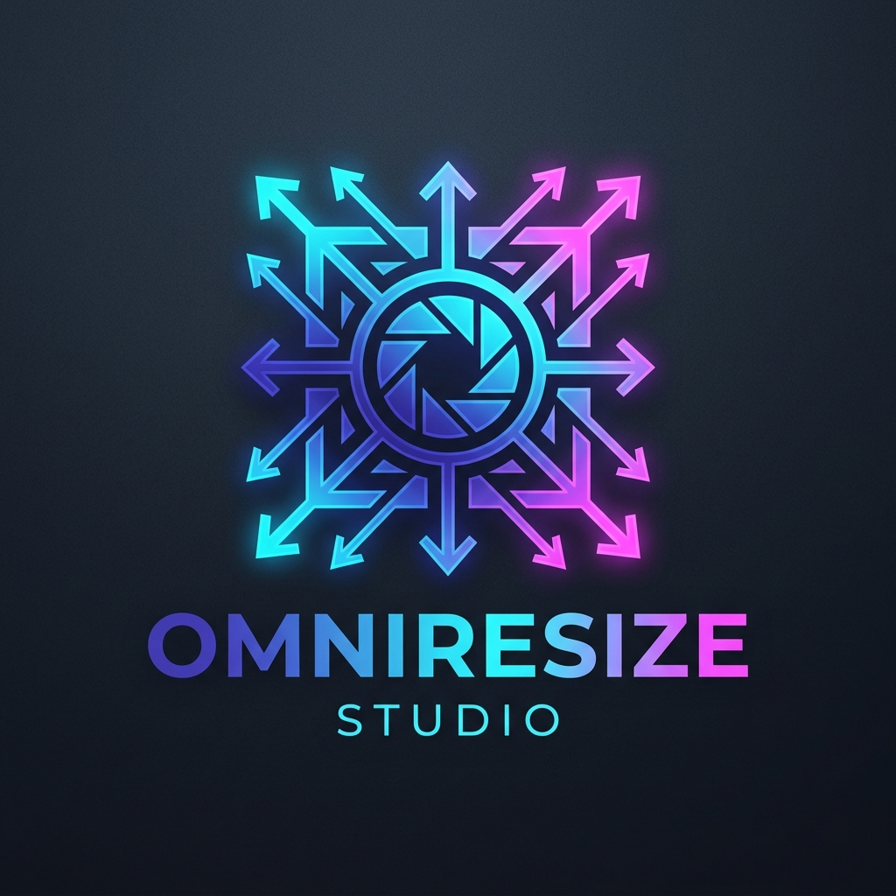

# OmniResize Studio 🎨⚡

<p align="center">
  
</p>

<p align="center">
  <strong>Fast, Privacy-First, In-Browser Image Resizer, Compressor & Photo Studio</strong>
</p>

<p align="center">
  <a href="https://omniresize.pro/"></a>
  
  
  
  
</p>

---

## 🌟 Overview

**OmniResize Studio** ([https://omniresize.pro/](https://omniresize.pro/)) is a high-performance, client-side web application designed to resize, compress, crop, and convert images directly in your browser.

Unlike traditional online converters that upload your confidential images to remote cloud servers, OmniResize runs **100% locally in your browser's memory (RAM)** using the HTML5 Canvas API and WebAssembly. Your photos, documents, and signatures never leave your device.

---

## 🚀 Key Features

* **🔒 100% Client-Side Privacy:** Zero server uploads. No database storage, zero tracking of uploaded files, and automatic removal of sensitive EXIF/GPS metadata.
* **🎯 Target File Size Compression (KB Mode):** Shrink photos to exact target sizes required by government portals, university exams, and job applications (e.g., exactly 10KB, 20KB, 50KB, 100KB, 200KB).
* **⚡ Bulk & Batch Processing:** Resize and convert hundreds of images simultaneously and download them in a single `.zip` file without hitting API limits or wait times.
* **📸 Passport & Visa Photo Maker:** Built-in templates for US, UK, Schengen, Indian Passport, and standard biometric ID specifications with background color selection and print-ready sheets.
* **✂️ Intelligent Image Cropping:** Freeform and fixed aspect ratio cropping (1:1, 4:5, 16:9, etc.) for Instagram, YouTube, LinkedIn, and social media.
* **🔄 Format Converter:** Effortlessly convert between WebP, PNG, JPEG, and iPhone HEIC formats in real-time.
* **📱 Progressive Web App (PWA):** Fully installable on Windows, macOS, Android, and iOS. Works seamlessly even when offline via Service Worker caching.
* **✨ Modern Light Theme UI:** Clean, distraction-free software interface engineered for readability, accessibility, and high productivity.

---

## 🛠️ Tech Stack

* **Frontend:** Semantic HTML5, Vanilla JavaScript (ES6+ modular architecture)
* **Styling:** Modern Vanilla CSS3 with standard design tokens (no framework bloat)
* **Libraries:**
  * [JSZip](https://stuk.github.io/jszip/) (bundled locally for offline archive generation)
  * [heic2any](https://github.com/alexcorvi/heic2any) (bundled locally for Apple HEIC decoding)
* **Deployment & CDN:** Cloudflare Pages / Cloudflare Workers Static Assets
* **SEO & Analytics:** Structured Schema.org JSON-LD data, XML Sitemap, Cloudflare Web Analytics

---

## 📁 Repository Structure

```text
omniresize/
├── assets/                  # Logos and application graphics
│   ├── logo.png
│   └── logo.svg
├── js/                      # Modular client-side logic
│   ├── app.js               # Main application orchestration & UI bindings
│   ├── batch.js             # Multi-file batch processing engine
│   ├── engine.js            # Core image resampling, binary search KB compressor
│   ├── cropper.js           # Interactive canvas crop controller
│   ├── filters.js           # Contrast, brightness, saturation adjustments
│   ├── presets.js           # Social media & dimension presets
│   └── vendor/              # Offline-bundled vendor dependencies
│       ├── heic2any.min.js
│       └── jszip.min.js
├── styles/                  # Clean modular design system
│   ├── main.css             # Design tokens, variables & base layouts
│   ├── components.css       # Buttons, cards, modals, form controls
│   ├── editor.css           # Workspace, canvas & preview styling
│   ├── bulk.css             # Batch queue & progress grid styles
│   └── footer.css           # Responsive footer & legal layouts
├── bulk-image-resizer.html  # Dedicated bulk processing tool
├── crop-image.html          # Interactive cropper tool
├── passport-photo-maker.html# Passport & visa creation tool
├── resize-image-to-10kb.html# Dedicated SEO landing pages
├── resize-image-to-20kb.html
├── resize-image-to-50kb.html
├── resize-image-to-100kb.html
├── resize-image-to-200kb.html
├── privacy.html             # Privacy Policy (GDPR / CCPA compliant)
├── terms.html               # Terms of Service
├── contact.html             # Contact page
├── site.webmanifest         # PWA Manifest configuration
├── sitemap.xml              # SEO Sitemap for Google Search Console
├── sw.js                    # Service Worker for offline PWA functionality
└── package.json             # Project metadata & npm run dev scripts
```

---

## 💻 Local Development Setup

No complex build steps, bundlers, or heavy node modules are required.

### 1. Clone the repository
```bash
git clone https://github.com/Saurav3587/omniresize.git
cd omniresize
```

### 2. Start a local HTTP server

**Using Python:**
```bash
# Python 3
python -m http.server 3000
```

**Using Node.js (`npx`):**
```bash
npx serve .
# or
npm run dev
```

### 3. Open in Browser
Visit `http://localhost:3000` in Chrome, Firefox, Safari, or Edge.

---

## 🔒 Security & Privacy Architecture

* **Zero Server Infrastructure:** The app operates statically with no backend server processing. All computations take place in browser memory (`Worker` / `Canvas2D` / `OffscreenCanvas`).
* **Zero Telemetry on Images:** No user images or image contents are transmitted over the network or saved to local storage.
* **Certified Compliance:** Fully compliant with GDPR, CCPA, and Google AdSense privacy policies.

---

## 📄 License

This project is licensed under the [MIT License](LICENSE) — feel free to use and adapt it for personal or commercial projects.
